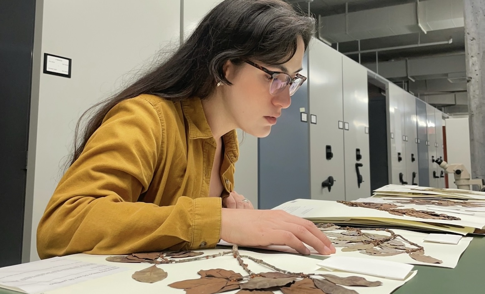

**[EN]** Postdoctoral scholar in **evolutionary biology specializing in phylogenomics, bioinformatics, and Neotropical plant diversity**. My research integrates computational and field-based approaches to uncover how plant diversity evolves and how we can better conserve it. I have a strong publication record in systematics and floristics of Neotropical groups, with expertise in integrative plant taxonomy, herbarium-based research, large-dataset management, reproducible bioinformatic pipelines, and phylogenomic and statistical methods. 

Ph.D. from UW–Madison under [Kenneth J. Sytsma](https://archive.botany.wisc.edu/ksytsma/sytsmalab/SytsmaLab/Welcome.html). Also served as Graduate Teaching Assistant in plant systematics, general botany, evolution, and introductory biology. Prior to my doctorate, I gained research experience in tropical forest ecology, carbon stock assessment, and peatland biogeochemistry with CIFOR, FAO, and IIAP in the Peruvian Amazon.

Fulbright Peru Fellow · P.E.O. International Peace Scholar · Smithsonian Institution Fellow. Certified Data Carpentries Instructor, actively engaged in mentoring, peer review, and public outreach in botany and biodiversity science.

---------

**[ES]** Científica posdoctoral en **biología evolutiva, especializada en filogenómica, bioinformática y diversidad vegetal del Neotrópico**. Mi investigación integra enfoques computacionales y de campo para comprender cómo evoluciona la diversidad vegetal y cómo podemos conservarla mejor. Cuento con una sólida trayectoria de publicaciones en sistemática y florística de grupos vegetales neotropicales, con experiencia en taxonomía vegetal integrativa, investigación basada en herbario, manejo de grandes conjuntos de datos, pipelines bioinformáticos reproducibles y métodos filogenómicos y estadísticos.
 
Doctorado en la Universidad de Wisconsin–Madison bajo la supervisión de [Kenneth J. Sytsma](https://archive.botany.wisc.edu/ksytsma/sytsmalab/SytsmaLab/Welcome.html). Me desempeñé como Asistente de Enseñanza de Posgrado en sistemática vegetal, botánica general, evolución y biología introductoria. Antes del doctorado, adquirí experiencia en ecología de bosques tropicales, evaluación de reservas de carbono y biogeoquímica de turberas con CIFOR, FAO e IIAP en la Amazonía peruana.
 
Beca Fulbright Perú · Beca Internacional de Paz P.E.O. · Beca Instituto Smithsonian. Instructora certificada de Data Carpentries, con participación activa en mentoría, revisión por pares y divulgación en botánica y ciencias de la biodiversidad.

See [here](https://github.com/phyloverse/phyloverse.github.io/blob/main/Mitidieri_Nicole_CV.pdf) for my CV.
