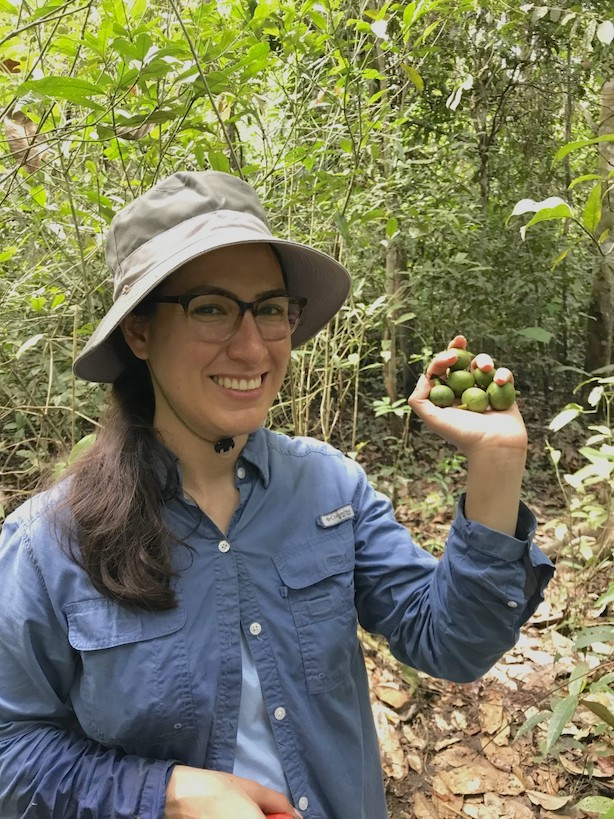

I am an evolutionary botanist from the Global South interested in the systematics, biogeography, and evolutionary history of Neotropical epiphytic, hemiepiphytic, and arboreal plants. In my PhD training, I studied the trait evolution in the big genus Ficus and allied genera in Moraceae and the systematics of Neotropical fig stranglers (Ficus sect. Americanae) from phylogenetic and geometric morphometric approaches. 

I am currently a Ph.D. candidate with [Kenneth J. Sytsma](https://archive.botany.wisc.edu/ksytsma/sytsmalab/SytsmaLab/Welcome.html) at the Department of Botany, University of Wisconsin-Madison. 
&nbsp;

&nbsp;

See [here](https://github.com/phyloverse/phyloverse3.github.io/blob/main/Mitidieri_Nicole_CV.pdf) for my CV.
