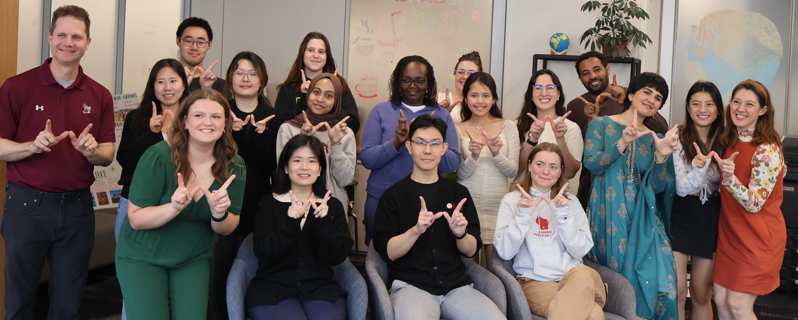

My current and past outreach and service experiences have been deeply enriching to my own journey as a female scientist because they connect my research expertise with broader academic, institutional, and public communities. Through service, I contribute to maintaining rigorous scientific standards, supporting equitable and inclusive academic environments, and mentoring the **next generation of botanists** and **citizen scientists**, while also gaining perspectives that strengthen my own scholarship and teaching. Engaging with diverse audiences, from international scholars and students to professional societies and the general public, has reinforced my commitment to collaborative science, ethical research practices, and the societal relevance of **plant systematics** and **biodiversity research**.

In my past role as a Ph.D. candidate and current role as a Postdoctoral Fellow, I have contributed to academic service and outreach through a range of roles that support research quality, inclusivity, and public engagement in botany. I serve as an ad hoc reviewer for *Taxon*, *Phytotaxa*, *Kew Bulletin*, *Novon*, and *Systematic Botany*, providing peer review of taxonomic and systematic manuscripts to ensure methodological rigor and advance botanical research standards. At the University of Wisconsin–Madison, I participated as a [REACH Ambassador](https://iss.wisc.edu/international-reach/international-reach-ambassadors-2025-26/) (2025–present), representing international scholars and fostering cross-cultural engagement, and a member of the [International Student Services Advisory Board](https://iss.wisc.edu/get-involved/issab/past-members-of-isab/) (2025–2026), advising on policies to enhance the academic experience and well-being of international students. I currently serve on award committees for the American Society of Plant Taxonomists and The Linnaean Society (2025–present), and have been an active committee member in the [Department of Botany](https://botany.wisc.edu/) (2022–2026), contributing to DEI, awards, social, and colloquium initiatives. 

I have mentored undergraduate students in herbarium-based research, supporting early-career development in plant biology. In addition, I am a [certified Data Carpentries Instructor](https://carpentries.org/community/instructors/) (2023–present), teaching R- and Python-based data management and programming skills to life science researchers to promote open, reproducible, and inclusive computational practices. 

My public outreach includes organizing and presenting webinars and lectures such as [e.g. *Vanilla* Perú](https://www.youtube.com/watch?v=L9SlFbp1QNs) (taxonomy, ecology, and conservation of *Vanilla* in Peru), [Mujeres Botánicas](https://www.youtube.com/watch?v=0ft7dgP33Ds&list=PLVgvlQRAmCp1CaPK0MgLLaHC0r74yiFYW) (highlighting women’s contributions to botany), the [Simposio de Orquídeas y Biodiversidad en Perú](https://www.youtube.com/watch?v=8cgUDDmgF7A&list=PLVgvlQRAmCp0FQJLgmr9pYErwLAVGk1XA&pp=0gcJCbAEOCosWNin) (orchid systematics and conservation), [Un abrazo que mata o da vida? El caso del género *Ficus*]() (ecological interactions and evolutionary strategies in *Ficus*), and [Botánica en tiempos del COVID](https://www.youtube.com/watch?v=98aiKe5TZSI&list=PLVgvlQRAmCp1Bw36RzBdbaXLUF8boZ1MS) (adapting botanical research during the pandemic).

Members of REACH at <i> UW-Madison</i>

