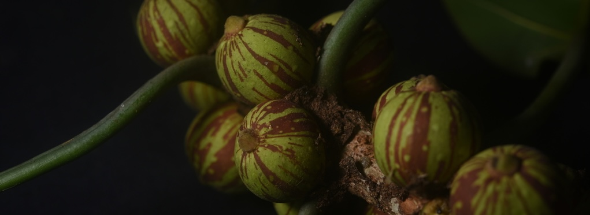

<i>Ficus paraesis</i>. © N. Mitidieri-Rivera

### Phylogenomic and diversification history of *Ficus* and allied genera in Moraceae
Understanding why biodiversity is unevenly distributed across tropical regions requires integrating phylogenetic, temporal, and biogeographic perspectives at broad evolutionary scales. In a recent synthesis, I contributed to reconstructing a comprehensive phylogenomic and temporal framework for Moraceae, with a particular emphasis on Ficus, enabling explicit inference of diversification dynamics across major lineages of the family ([Mitidieri et al. 2025. *Annals of Botany*](https://academic.oup.com/aob/advance-article/doi/10.1093/aob/mcaf101/8133158)). This work integrates genome-scale data with broad taxonomic sampling to resolve deep relationships within Moraceae and to evaluate how speciation rates, lineage accumulation, and historical biogeographic processes have shaped present-day diversity patterns.

A central outcome of this research is a clearer resolution of how *Ficus* fits within the broader evolutionary radiation of Moraceae, providing a comparative framework to assess whether its exceptional species richness reflects shifts in diversification rates, ecological opportunity, or historical contingency. By placing Neotropical lineages within a global phylogenetic context, this work also contributes to ongoing efforts to explain asymmetries in tropical biodiversity, particularly the uneven distribution of diversity across biogeographic regions and clades.

### High-throughput phylogenomic backbone for Neotropical figs
Establishing a robust evolutionary framework is essential for understanding the diversification, systematics, and ecological roles of flowering plants. I develop a high-throughput phylogenomic backbone for Neotropical Ficus, integrating genomic data with dense taxonomic sampling to resolve deep and shallow evolutionary relationships across the clade. By combining targeted sequencing approaches with rigorous phylogenomic inference, my work clarifies long-standing taxonomic ambiguities, provides a stable framework for species delimitation and nomenclature, and enables downstream studies of diversification, biogeography, and trait evolution in one of the most ecologically important plant lineages of the Neotropics.

### Nomenclatural review of *Ficus* sect. *Americanae*
Accurate and stable nomenclature is fundamental to all areas of biological research, as it provides the shared language through which biodiversity is documented, compared, and conserved. I conducted the first nomenclatural review of Neotropical strangler figs (*Ficus* sect. *Americanae*), focusing on the clarification and stabilization of long-standing taxonomic names. My work involved the critical examination of original descriptions, historical literature, typifications, and protologues under the International Code of Nomenclature ([Mitidieri et al. 2025. *Phytotaxa*](https://phytotaxa.mapress.com/pt/article/view/phytotaxa.711.3.1); [Mitidieri et al. 2026. *Phytotaxa*](https://phytotaxa.mapress.com/pt/article/view/phytotaxa.739.2.3)), with particular attention to misapplied names, nomina dubia ([Mitidieri et al. 2025. *Taxon*](https://onlinelibrary.wiley.com/doi/10.1002/tax.70084); [Mitidieri et al. 2026. *Taxon*](https://onlinelibrary.wiley.com/doi/10.1002/tax.70112)), and illegitimate or superfluous names. By resolving synonymy and typification issues, my research provides a robust nomenclatural framework that underpins accurate species delimitation and comparative studies of Neotropical fig diversity.
<i>I am exploring this idea further in Moraceae and its sister clades, and would love to chat with any potential collaborators.</i>
