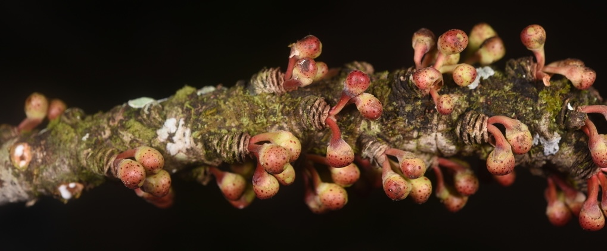

I am interested in **explaining the origins of asymmetric biodiversity across tropical regions, particularly within the Neotropics**. My research combines phylogenomics, museum genomics, and evolutionary ecology to reconstruct the temporal and spatial processes that have driven lineage diversification and community assembly in tropical plants. Leveraging both contemporary and historical collections, alongside lab and field investigations, I use figs (*Ficus* L., Moraceae) and associated Neotropical floras as model systems to address fundamental questions about the evolution of tropical biodiversity.
