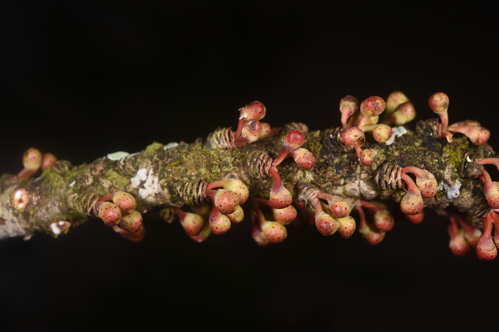

To answer foundational and contemporary questions at the intersection of ecology and evolution, my current research uses figs (Ficus L., Moraceae) as model plants in high-throughput and rigorous experiments in the lab, greenhouse, and natural Andean-Amazonian systems.

### High-throughput phylogenomic backbone for Neotropical figs
Establishing a robust evolutionary framework is essential for understanding the diversification, systematics, and ecological roles of flowering plants. I develop a high-throughput phylogenomic backbone for Neotropical Ficus, integrating genomic data with dense taxonomic sampling to resolve deep and shallow evolutionary relationships across the clade. By combining targeted sequencing approaches with rigorous phylogenomic inference, my work clarifies long-standing taxonomic ambiguities, provides a stable framework for species delimitation and nomenclature, and enables downstream studies of diversification, biogeography, and trait evolution in one of the most ecologically important plant lineages of the Neotropics.

### Natural field experiments on fig biology
Experiments conducted in laboratory and greenhouse settings are most powerful when explicitly grounded in ecological and evolutionary processes observed in natural plant communities. In this research program, Neotropical strangler figs (Ficus spp.) are employed as a model system to investigate eco-evolutionary dynamics through the direct study of in situ interactions among fig hosts, their obligate pollinating fig wasps, and the diverse assemblage of vertebrate and invertebrate consumers that interact with fig species across their life cycle. By integrating field-based experimental approaches I link the unique biology of fig–fig wasp mutualisms to broader questions of colonization, persistence, and species coexistence in tropical forests. Current projects focus on: (1) elucidating how variation in fig wasp community composition and behavior influences pollination success, reproductive output, and host establishment during the early stages of strangler fig colonization; (2) assessing spatial and temporal variation in multitrophic interactions involving frugivores, seed dispersers, and antagonists, and their consequences for fig recruitment and coexistence across heterogeneous forest landscapes; and (3) examining the ecological and molecular mechanisms that underlie the dispersal, establishment, and diversification of Neotropical fig lineages in relation to their tightly coupled mutualists. Collectively, this work leverages the fig–fig wasp system as a natural laboratory for understanding how biotic interactions structure ecological communities and drive evolutionary dynamics in species-rich tropical ecosystems.

### Nomenclatural review of Neotropical fig stranglers
Accurate and stable nomenclature is fundamental to all areas of biological research, as it provides the shared language through which biodiversity is documented, compared, and conserved. I conduct nomenclatural reviews of Neotropical strangler figs (Ficus L.), focusing on the clarification and stabilization of long-standing taxonomic names. My work involves the critical examination of original descriptions, historical literature, typifications, and protologues under the International Code of Nomenclature (e.g., [Mitidieri et al. 2025. Phytotaxa](https://phytotaxa.mapress.com/pt/article/view/phytotaxa.711.3.1)), with particular attention to misapplied names, nomina dubia (e.g., [Mitidieri et al. 2025. Taxon](https://onlinelibrary.wiley.com/doi/10.1002/tax.70084?utm_medium=article&utm_source=researchgate.net)), and illegitimate or superfluous names. By resolving synonymy and typification issues, my research provides a robust nomenclatural framework that underpins accurate species delimitation and comparative studies of Neotropical fig diversity.
<i>I am exploring this idea further in Moraceae and its sister clades, and would love to chat with any potential collaborators.</i>
